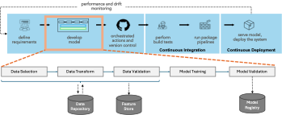

# Structuring the Codebase and Team Responsibilities

Building a complete CI/CD (Continuous Integration/Continuous Deployment) flow for machine learning (ML) development involves several key components, including code organization, data management, model training and validation, deployment, and monitoring. Here's a structured approach to set up your CI/CD pipeline along with the team responsibilities.

## Codebase Structure

A well-organized codebase is crucial for maintaining and scaling your ML projects. Here’s a suggested structure. You can use our Github project template to start your ML development process with the demonstrated folder structure: <https://github.com/asabuncuoglu13/faid-template>


## CI/CD Pipeline Stages



1. **Version Control (Git)**
   - All code, configurations, and documentation are stored in a version control system (e.g., Git).
   - Use branching strategies (e.g., feature branches, develop, main).

2. **Continuous Integration (CI)**
   - Automate code testing using tools like Jenkins, GitLab CI, or GitHub Actions.
   - Run unit tests, integration tests, and linting on every commit.
   - Ensure data pipeline and feature engineering scripts are tested.

3. **Model Training and Validation**
   - Automate model training pipelines using tools like MLflow, Kubeflow, or Airflow.
   - Use versioning for models and datasets to track changes.
   - Validate models with a holdout validation set and cross-validation.

4. **Model Deployment**
   - Containerize models using Docker.
   - Deploy models using Kubernetes, AWS SageMaker, or other cloud services.
   - Use CI/CD tools to automate the deployment process.

5. **Monitoring and Logging**
   - Monitor model performance in production (e.g., latency, accuracy).
   - Set up logging for data inputs, model predictions, and errors.
   - Use monitoring tools like Prometheus, Grafana, or ELK stack.

6. **Feedback Loop**
   - Implement a feedback loop for continuous improvement.
   - Gather feedback from model performance and retrain models as necessary.
   - Update pipelines and configurations based on new requirements and findings.

## Example CI/CD Tools and Technologies

- **Version Control**: Git, GitHub, GitLab
- **CI/CD Tools**: Jenkins, GitLab CI, GitHub Actions, CircleCI
- **Containerization**: Docker, Kubernetes
- **ML Pipeline Tools**: MLflow, W&B, Kubeflow, Apache Airflow
- **Cloud Services**: AWS, Google Cloud, Azure
- **Monitoring and Logging**: Prometheus, Grafana, ELK Stack (Elasticsearch, Logstash, Kibana)

## Potential Integration of DVC (Data Version Control)

```{note}
#TODO: Include a real-life example with a repository.
```

Integrating DVC (Data Version Control) into your project to enable proactive monitoring of bias in data sources involves several steps. DVC helps in versioning datasets and tracking changes, which is crucial for maintaining data integrity and monitoring for bias.

1. **Install DVC**:
   ```bash
   pip install dvc
   ```

2. **Initialize DVC in Your Project**:
   ```bash
   dvc init
   ```

3. **Add Data to DVC**:
   ```bash
   dvc add data/raw
   git add data/raw.dvc .gitignore
   git commit -m "Add raw data to DVC"
   ```

4. **Set Up Remote Storage**:
   The remote storage can be AWS S3, Google Cloud Storage, etc. It can also be a local folder.
   ```bash
   dvc remote add -d myremote s3://mybucket/path
   ```

5. **Push Data to Remote Storage**:
   ```bash
   dvc push
   ```

6. **Integrate Bias Detection Tools**:
   Use bias detection tools like Fairlearn, AI Fairness 360, or custom scripts to evaluate bias in your datasets. Create a bias evaluation script that uses these tools.

   **Example Bias Evaluation Script (bias_check.py)**:
   ```python
   import pandas as pd
   from fairlearn.metrics import demographic_parity_difference, equalized_odds_difference

   def load_data(file_path):
       return pd.read_csv(file_path)

   def evaluate_bias(data, target, sensitive_feature):
       dp_diff = demographic_parity_difference(data[target], data[sensitive_feature])
       eo_diff = equalized_odds_difference(data[target], data[sensitive_feature])
       return dp_diff, eo_diff

   if __name__ == "__main__":
       data_path = "data/raw/dataset.csv"
       data = load_data(data_path)
       dp_diff, eo_diff = evaluate_bias(data, 'target_column', 'sensitive_column')
       print(f"Demographic Parity Difference: {dp_diff}")
       print(f"Equalized Odds Difference: {eo_diff}")
   ```

7. **Integrate Bias Check into CI/CD Pipeline**:
   Incorporate the bias check into your CI/CD pipeline to automatically run the script whenever there is a data change.

   **Example GitHub Actions Workflow (bias_check.yml)**:
   ```yaml
   name: Bias Check

   on:
     push:
       paths:
         - 'data/**'
     pull_request:
       paths:
         - 'data/**'

   jobs:
     bias_check:
       runs-on: ubuntu-latest
       steps:
         - name: Checkout repository
           uses: actions/checkout@v2

         - name: Set up Python
           uses: actions/setup-python@v2
           with:
             python-version: '3.8'

         - name: Install dependencies
           run: |
             python -m pip install --upgrade pip
             pip install dvc
             pip install fairlearn

         - name: Pull data from DVC remote
           run: |
             dvc pull

         - name: Run bias check
           run: |
             python bias_check.py
   ```

8. **Monitor and Respond to Bias Metrics**:
   Set thresholds for acceptable bias metrics and configure alerts or automated responses if the thresholds are exceeded. Use the output from the bias_check.py script to determine if the data changes introduce significant bias.