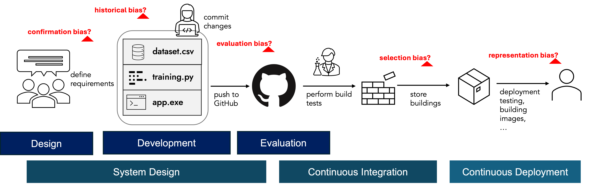

# Continuous Delivery of Safe AI



The above diagram illustrates a simplified ML development pipeline. A typical pipeline consists of multiple branches with iterative processes, involving multiple contributors. Different forms of bias types can occur in each step. 

Defining fairness-aware CI/CD type flows that can automate building multiple artefacts for different teams can support building a common understanding in bias mitigation for organisations. In this article, we demonstrate potential approaches to monitor ML pipelines throughout the development lifecycle.

## Prerequisites

Structuring an ML project requires similar skills to any data-centric research. We recommend reviewing the following tips to support your design and management process. The key requirement to monitor the potential fairness (or security, privacy, etc.) issues is maintaining a clean and maintainable code. There are many great books about maintaining a healthy codebase, so I will not go into details here. 

1. You can check [NCSC's guidance](https://www.ncsc.gov.uk/collection/developers-collection/principles/produce-clean-maintainable-code) on secure development and deployment of software systems.
2. The Turing Way project provides a set of useful reading materials to organise your codebase for reproducibility: <https://book.the-turing-way.org/reproducible-research/reproducible-research>

These resources are free. If you would like to read some books, see the list below.

```{seealso} 

**Recommended books:**

- Structure and Interpretation of Computer Programs (SICP) by Ableton, Sussman, Sussman
- The Pragmatic Programmer by David Thomas, Andrew Hunt
- Architecture Patterns with Python: Enabling Test-Driven Development, Domain-Driven Design, and Event-Driven Microservices by Bob Gregory and Harry Percival
```

## CI/CD: Continuous Integration and Delivery

Before starting automating the parts of your codebase (e.g. testing your code against adversarial scenarios, building releases), I suggest checking the prerequisities of this article and structure your clean and reproducible codebase.

CI/CD stands for Continuous Integration and Continuous Delivery (or Continuous Deployment). It is a software development practice where code changes are automatically tested and integrated (CI), and then automatically delivered or deployed to production (CD), ensuring faster and more reliable updates. Based on your needs, integration and delivery parts can be automated via different libraries, and you can maintain the overall pipeline through tools provided by Github.

```{admonition} Check these examples:

- A Good Example of a Complete RAG Application: https://github.com/octodemo/contoso-chat-dhanachavan
- Example Actions: https://github.com/microsoft/security-devops-action

```

## Using Tools for Experiment Tracking

You can use tools like [wandb](https://wandb.ai/site), [Neptune](https://neptune.ai/), and [mlflow](https://mlflow.org/) to track and maintain records of your ML experiments. These open-source platforms allow you to register models and experiments for easy maintainability.

While these libraries are useful for tracking progress and sharing insights with your team, they aren't optimized for fairness-focused processes. In such cases, it's important to foster interdisciplinary conversations and track fairness metrics, discrimination cases, and related outputs.

We designed FAID to integrate easily with these tools, making it simple to log fairness-related data. Developers can also add FAID scripts directly to their codebase for customized tracking formats (see [FAID's Guide on this issue](https://github.com/asabuncuoglu13/faid/tree/main/docs/direct-integration.md)). 

If you're already using these libraries, FAID's logging behavior will feel familiar.

```python
import random
import wandb
import mlflow
from faid import faidlog
```

### Initialise

You first initialise the project with the name and config details. These functions basically creates the metadata for the experiment. 

```python
# Init weight&biases
run = wandb.init(project= project, config= config)
```

```python
# Init mlflow
mlflow.set_experiment(project)
```

```python
# init the log files
faidlog.init()
# create (or get) fairness experiment context
ctx = faidlog.ExperimentContext(name=experiment_name)
```

# Run Experiments and Record Logs

After initialising and create a managable workflow, you can log whatever metric, outcome, or any other variable you want to store and monitor using these libraries.

```python
# Log the hyperparameters
# simulate training
epochs = 10
offset = random.random() / 5
for epoch in range(2, epochs):
    acc = 1 - 2 ** -epoch - random.random() / epoch - offset
    loss = 2 ** -epoch + random.random() / epoch + offset

    # log metrics to wandb
    metrics = {"acc": acc, "loss": loss}
```

```python
wandb.log(metrics)
```

```python
mlflow.log_params(metrics)
```

```python
ctx.add_model_entry(key="metrics", entry=metrics)
```

faid fairness recording format has three main entries: Context, Model and Data. It is to remind developers that, after each experiment, they will transfer this experiment knowledge to a standard report format: Project Overview, Model Card, Data Card.

## Why Do You Need a Separate Logging Library for Fairness?

When experimenting with data and models, you generate a large amount of information. However, not all of this information is relevant to fairness. Fairness researchers require a specific set of data points and metrics to assess and ensure fairness throughout the machine learning pipeline. Extracting and providing this specific information can become an additional burden for ML engineers, who may already be managing numerous tasks.

A dedicated logging library for fairness can streamline this process. By proactively defining fairness requirements and automatically monitoring the parameters related to these requirements, we can:

1. **Reduce Workload**: Automate the extraction and logging of relevant fairness metrics, freeing ML engineers from the manual task of selecting and providing this information.
2. **Minimize Errors**: Decrease the likelihood of mistakes that can occur with manual data handling and reporting.
3. **Ensure Consistency**: Maintain a standardized approach to logging fairness-related data, which can enhance the reliability and comparability of fairness assessments.
4. **Enhance Focus**: Allow fairness researchers to concentrate on analyzing the relevant data without the distraction of unrelated information.

## Using FAID with [CMF](https://hewlettpackard.github.io/cmf/) and [DVC](https://dvc.org/)

The design principles of our metadata management shares the similar design decisions with CMF. While developing our tool, we also checked the compatability of using the tool together with CMF and DVC to allow version control throughout the fairness research lifecycle.

#TODO: Add VCS workflows


## Opening Data and Models

Creating an open-source ML repository demands additional requirements to responsibly release the outputs. Model Openness Framework defines three layers while assessing openness and completeness of AI development artifacts. 

- [ ] Open Model layer includes model architecture, model parameters, technical report, evaluation results, model card, data card and sample model outputs.
- [ ] Open Tooling layer includes the codes of training, inference, evaluation, data used for evaluation, supporting libraries and tools, and all components from Open Model layer.
- [ ] Open Science layer includes research paper, all datasets, data pre-processing code, model parameters, model metadata, and all components of Open Tooling layer.

Delivering all these artifacts continuously in a transparent way requires a good carefully designed comprehensive orchestration flow.

## Useful Readings

1. [How To Organize Continuous Delivery of ML/AI Systems: a 10-Stage Maturity Model](https://outerbounds.com/blog/continuous-delivery-of-ml-ai/)
2. [Examples from Neptune AI](https://neptune.ai/blog/build-mlops-pipelines-with-github-actions-guide)
3. [DVC - ML Pipeline Automation Tutorial](https://dvc.ai/blog/automate-your-ml-pipeline-combining-airflow-dvc-and-cml-for-a-seamless-batch-scoring-experience)
