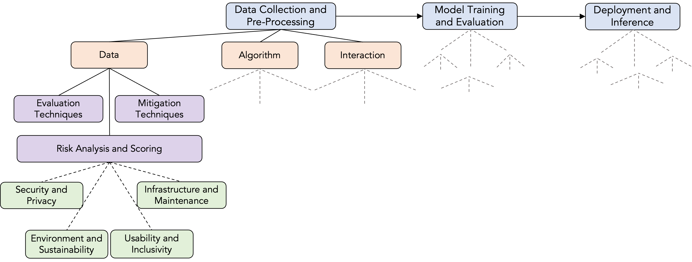

# Mitigating Bias

[Bias Types](./bias.md) chapter demonstrated possible challenges in identifying bias. Mitigating this harmful bias is a challenging issue due to the complex and sociotechnical nature of model learning development pipelines. In this process, developers aim to develop a model with prediction or generation capabilities using a vast amount of data. This model eventually produces false predictions or unexpected outputs. Due to this unexpected behaviours, some individuals from disadvantaged/protected groups are harmed more. The aim of mitigating bias is to minimise this as much as possible by establishing an active human-in-the-loop approach to identify mis-represented individuals better.

## Potential Approaches for Bias Mitigation in AI Lifecycle

Practitioners can mitigate bias in AI systems by applying a variety of approaches throughout the entire AI lifecycle, from project planning to deployment and monitoring. It's crucial to adopt a context-based and society-centered approach to understanding AI fairness, acknowledging the plurality of views on its meaning. A multi-pronged approach that integrates formal and substantive/transformative approaches to non-discrimination is necessary.



We already presented our evaluation and monitoring approach in the [Chapter - Continuous Safety Monitoring](../../assurance/monitoring.md) with the hierarchical structure illustrated with the figure above. Follow a similar structure to shape your mitigation process and align it with your risk management process.

### Project Planning and Problem Formulation

In this stage, understanding the stakeholder needs and equity considerations is crucial:

*   **Equity Considerations:** At the earliest stage, consider the real-world context of the problem and how existing social and economic patterns of disadvantage, injustice, and discrimination might lead to unequal distribution of risks and benefits of the AI system.
*   **Stakeholder Engagement:** Conduct a stakeholder impact analysis in partnership with impacted communities to ensure that the project objectives account for the social and economic conditions of stakeholders and align with their sense of justice.
*   **Fairness-Aware Objectives:** Ensure the objectives of the AI project are nondiscriminatory and acceptable to those affected.
*   **Problem Formulation with Fairness in Mind:** Technical and non-technical team members should collaboratively translate project goals into measurable targets, considering how vulnerable groups might be negatively impacted by the specification of outcome variables and proxies. Diversity and inclusive participation are crucial from the start.
*   **Bias Self-Assessment and Risk Management:** Begin a collaborative [Bias Self-Assessment and Risk Mitigation Plan](https://alan-turing-institute.github.io/rrp-selfassessment/bias/bias-intro.html), informed by potential biases relevant to this stage.

### Data Extraction, Procurement, and Analysis

*   **Data Fairness:** Prioritise responsible data acquisition, handling, and management.
*   **Representativeness:** Ensure datasets are properly representative of the underlying population to be modeled to avoid systematic disadvantaging of vulnerable groups due to underrepresentation or overrepresentation. Domain expertise is crucial here.
> Use Exploratory Analysis tools in this stage such as [What-If Tool](https://pair-code.github.io/what-if-tool/).
*   **Fit-For-Purpose and Sufficiency:** Collect a sufficient quantity of data that adequately represents the significant attributes of the population to avoid unfair outcomes.
*   **Source Integrity and Measurement Accuracy:** Scrutinise the sources and instruments of measurement to prevent the introduction of discriminatory factors. Be aware that biased prior human decisions can become the 'ground truth' of the model.
*   **Timeliness and Recency:** Ensure the timeliness and recency of all data elements.
*   **Relevance and Appropriateness:** Utilise the most appropriate sources and types of data**, guided by solid domain knowledge.
*   **Addressing Historical Bias:** Recognise that pre-existing societal discrimination can be drawn into this stage and perpetuated.
*   **Mitigating Missing Data Bias:** Be aware that missing data can lead to inaccurate inferences, especially if the missingness is statistically informative and related to social factors.

### Preprocessing and Feature Engineering

*   **Fairness-Aware Categorisation:** Make choices about how to classify, categorise, and structure raw inputs in a fairness-aware manner, considering social contexts that might introduce bias. Review automated or outsourced classifications.
*   **Careful Feature Selection:** Select attributes or features that are relevant and rationally required for unbiased classification or prediction. Be mindful of how grouping or disaggregating features or excluding them can impact historically marginalised groups. Discrimination awareness, domain knowledge, and policy expertise are essential.
*   **Counterfactual Data Augmentation:** Balance labels across different demographic groups in the training data by augmenting the original corpus with causal interventions, replacing sensitive attributes with those of the opposite demographic. Combine CDA with other debiasing strategies for better results.
*   **Data Calibration:** Create fairer training corpora by calibrating harmful information in the data, potentially by removing biased texts or creating counterfactual biased text from fair text.

### Model Selection and Training

*   **Explainability vs. Performance:** Consider the trade-offs between model performance and explainability, especially when dealing with sensitive data, as interpretability can help detect discriminatory elements.
*   **Differential Performance for Subgroups:** Pay attention to how the chosen algorithm performs for different subgroups of the population and mitigate any possible discriminatory effects of choosing one model over another. Consult with the wider team and impacted stakeholders about acceptability of trade-offs.
*   **Bias Risks in Hyperparameter Tuning:** Be attentive to bias risks during hyperparameter tuning, setting metrics, and resampling data. Encourage peer review and consultation to align choices with bias mitigation goals.
*   **In-processing Debiasing:** Incorporate fairness into the LLM's design by tuning parameters through retraining optimisation, disentanglement, alignment constraints, and contrastive learning. Retraining can directly reduce bias, and techniques like dropout regularisation can help. Disentanglement methods remove biases while preserving useful information by projecting representations into orthogonal subspaces.
*   **Empirical Risk Minimisation under Fairness Constraints:** Adapt algorithms with built-in safeguards to avoid discrimination by design.

### Model Testing and Validation

*   **Evaluate for Fairness:** Alongside accuracy, explicitly test and validate models for fairness across different demographic groups.
*   **Metric-Based Fairness:** Operationalise lawful, clearly defined, and justifiable formal metrics of fairness to allocate the distribution of outcomes and error rates for relevant groups. Ensure transparency of these metrics to stakeholders. Understand the difference between group and individual fairness.
*   **Consider Differential Performance:** Justify any differences in the distribution of model outputs or error rates across different groups.
*   **Design Bias Reports:** Practice assessing how bias may play out throughout the different stages of designing AI systems and document findings.

### System Implementation and Deployment

*   **Implementer Training:** Provide adequate training and support to on-the-ground users for responsible and unbiased deployment. Training should cover the statistical nature and limitations of AI, avoid anthropomorphic portrayals, and emphasise AI's role in assisting, not replacing, human judgment.
*   **Awareness of Implementation Biases:** Train implementers on potential _decision-automation bias (overreliance)_ and _automation-distrust bias_.
*   **Contextual Awareness:** Train implementers to think contextually and holistically about how statistical generalisations apply to individual situations and to consider the unique life circumstances of decision subjects.
*   **User-System Interface Design:** Design user interfaces that encourage active user judgment and situational awareness and make the system's rationale clear and accessible.
*   **Taking Account of Individual Context:** Fair implementation should include considerations of the specific context of each impacted individual when using decision-support systems based on statistical inferences.
*   **Develop a Fairness Position Statement:** Prepare a statement that makes explicit the chosen formal fairness metrics and the rationale behind them in plain language, making it publicly available for review.

### System Use and Monitoring

*   **Continuous Monitoring:** Continuously monitor the AI system for any new or unforeseen negative effects on people with protected characteristics.
*   **Data Collection and Analysis:** Collect and analyse data to understand and monitor whether the intended benefits are realised, negative impacts are mitigated, and new negative effects have emerged.
*   **Feedback Mechanisms:** Establish mechanisms for feedback from users and affected individuals to identify and address potential biases in practice.
*   **Iterative Improvement:** Be prepared to adapt the way the AI system is used or even stop its use if it leads to unlawful discrimination or unmitigated negative impacts.

### Ecosystem Considerations

*   **Address Ecosystem-Level Inequities:** Recognise that the AI lifecycle is embedded in wider social systems and that ecosystem-level inequities can steer AI research and innovation in biased ways.
*   **Promote Diversity and Inclusion:** Foster diversity and inclusion on AI project teams to mitigate biases in application decisions and resource allocation.
*   **Consider Research Bias:** Be aware of potential biases in how AI research is funded, conducted, and disseminated, which can lead to gaps in public interest research.

Throughout all stages, it's essential to remember that fairness is not a purely technical construct and requires interdisciplinary analysis involving social, philosophical, and legal perspectives. Abstraction in technical solutions alone can be ineffective if it doesn't account for the broader sociotechnical system. A shift towards a process-oriented and risk-based design that includes social actors with a clear understanding of potential harms is crucial. By embracing a culture of continuous and proactive approach about overall AI safety, practitioners can achieve "safety-by-design".

# Bias Detection throughout the Pipeline

Monitoring, detecting and evaluating bias throughout an ML development pipeline is crucial for ensuring fairness and equity in your models. Here’s a structured approach to incorporating bias evaluation and continuous monitoring in your pipeline, along with recommended tools and libraries.

```{seealso}
Checkout our [financial sentiment analysis fairness evaluation repository](https://github.com/asabuncuoglu13/faid-test-financial-sentiment-analysis) that demonstrates how we converted a bias analysis notebook to a maintainable and automated codebase with CI/CD integrations.
```

# Proactive Fairness Monitoring

We view bias as a systemic error with multiple components. To evaluate bias in a machine learning model, practitioners typically use "protected attributes" to divide a population into groups. According to the EHRC guide, these attributes include age, disability, gender reassignment, pregnancy and maternity (including breastfeeding), race, religion or belief, sex, and sexual orientation {cite}`ehrc_24`. For each protected attribute, we can identify privileged and underprivileged groups based on whether the group has a systematic advantage. Our goal throughout the pipeline is to assess whether any bias occurs that could lead to discrimination at the individual or group level (see [Fairness Notions](../fairness/notions.md) for a detailed explanation).

## Bias Sources throughout the Pipeline

The below table demonstrates bias sources listed in the recent [International AI Safety Report](https://www.gov.uk/government/publications/international-ai-safety-report-2025). The bias sources and descriptions are directly obtained from the report:

| Lifecycle Stage          | Bias Source              | Description  | Example (Credit Scoring Risk) |
|-------------------------|-------------------------|-------------|--------------------------------|
| **Data Collection**      | Sampling Bias          | Certain perspectives, demographics, or groups are overrepresented or underrepresented in the data. | Credit scoring data primarily collected from urban customers may not generalize well to rural populations. |
|                         | Selection Bias         | Only certain data types or contexts are included, limiting representativeness. | Excluding alternative credit data, such as rent or utility payments, may disadvantage individuals without traditional credit history. |
| **Data Annotation**      | Labeller Bias         | Annotators' backgrounds, perspectives, and cultural biases affect their classification of data, influencing the labeling process. | Loan officers manually classifying high-risk applicants may unconsciously rate applicants from certain backgrounds as riskier. |
| **Data Curation**        | Historical Bias        | Reflecting or perpetuating past societal biases within curated data. | Using past loan approval data that historically favored certain demographics may lead to models reinforcing systemic discrimination. |
| **Data Pre-processing**  | Feature Selection Bias | Excluding relevant features from a dataset. | Removing non-traditional financial indicators, like employment stability, can reduce the accuracy of risk assessments for self-employed individuals. |
| **Model Training**       | Label Imbalance       | Unequal representation in labeled data, leading to biased model outputs. | Training a credit scoring model primarily on high-income applicants may cause it to inaccurately assess low-income borrowers. |
| **Deployment Context**   | Contextual Bias       | A model is trained on data from a context that differs from its application, leading to worse outcomes for certain groups. | A credit scoring model trained in a high-income country may not perform well in a developing economy with different financial behaviors. |
| **Evaluation & Validation** | Benchmark Bias      | Evaluation benchmarks favor certain groups or knowledge bases over others. | Testing a credit model primarily on data from prime borrowers may result in poor predictions for subprime borrowers. |
| **Feedback Mechanisms**  | Feedback Loop Bias   | Models learn from biased user feedback, reinforcing initial biases. | A credit scoring system that lowers scores for rejected applicants (assuming they are high-risk) may prevent them from improving their credit over time. |

### Data Pipeline: Collection, Preprocessing, Feature Engineering

An essential step in identifying bias is checking the data distribution in both raw and processed data. There are effective tools available to analyze feature distribution and identify imbalances. For instance, [**ydata-profiling**](https://github.com/ydataai/ydata-profiling) can generate profiling reports from a pandas DataFrame, and the [**Great Expectations**](https://github.com/great-expectations/great_expectations) library can validate, document, and profile data. 

It's crucial to ensure that data cleaning and feature engineering processes do not inadvertently introduce bias. The selected/generated features can introduce bias. Or, features can be proxies for the sensitive attributes (can carry hidden correlation). Therefore, it's important to run profiling after each step using a human-in-the-loop approach.

**The generated report should include**:
- Summary statistics and distribution visualizations.
- Details of missing values and imbalanced classes.
- Findings regarding assumptions and experiments conducted on the data.
- Correlation analysis between features and sensitive attributes.

## Model Pipeline: Training, Evaluation, Deployment

In this step, we should evaluate models using fairness metrics along with traditional performance metrics. Based on the evaluation results, we will apply bias mitigation techniques. We can also use A/B testing (or similar methodologies) to ensure new models do not introduce bias compared to previous versions.

We can evaluate the model performance with different evaluation metrics using fairness mitigation libraries such as [**fairlearn**](https://fairlearn.org/) and [**AI Fairness 360 (AIF360)**](https://aif360.readthedocs.io).

For the monitoring, we can utilise **Prometheus**, **Grafana**, **Evidently**. Thesese platforms provide different capabilities with different customisation levels for AI production pipelines. 


**The generated report should include**:
- Evaluation results of models using fairness metrics like disparate impact, equal opportunity difference, and others.
- Steps of bias mitigation techniques.

## How is this process proactive?

In this ML pipeline, we created a workflow that you can monitor the development process of an ML project. However, establishing clear fairness metrics and thresholds for each stage depends on the use case. For example, a credit scoring application might require a different setup than a financial news analyser NLP model.

For each use case, using lifecycle management tools to integrate continuous monitoring into your CI/CD pipeline, setting up automated alerts for when bias metrics exceed predefined thresholds, building mechanisms to support running regular external audits of the entire pipeline, and engaging with diverse stakeholders to gather feedback is essential to align the fairness evaluation scores with real-world impacts.

By integrating these tools and following this structured approach, you can proactively evaluate and mitigate bias throughout the entire ML lifecycle, ensuring fairness and equity in your models.