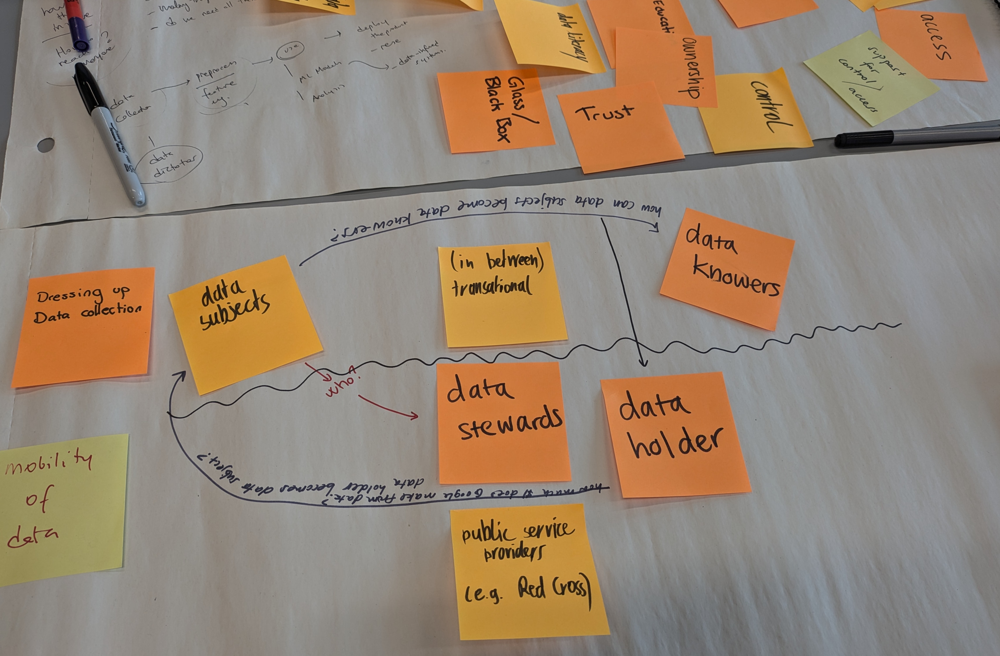
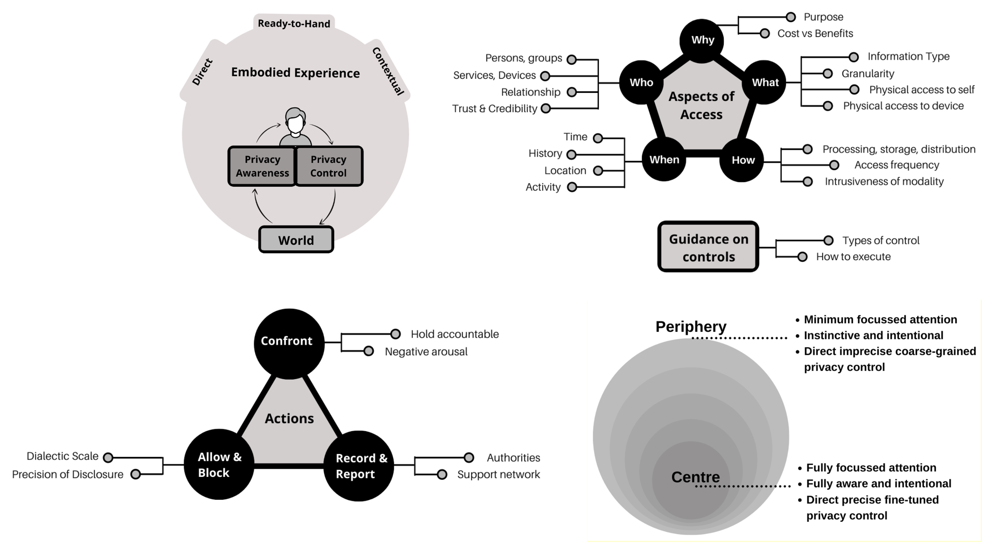

# Exploring Participatory Data Governance

*Insights from the DIS’24 Workshop*



On July 1, I participated in a workshop focused on alternative data governance structures. The event brought together a diverse group of HCI researchers, practitioners, and designers from various disciplines. The goal was to discuss the potential of participatory, community-led, and inclusive approaches to data governance. And the main question in my mind was to explore equitable and representative data practices.

```{note}
See the workshop details here: <https://sites.google.com/view/dataofbyforpeople/call-for-participation>
```

Throughout the workshop, the term "trust" surfaced repeatedly in our discussions. It became evident that we each had varying interpretations of this concept. Given the extensive philosophical and practical research conducted over centuries, this diversity of understanding was both understandable and expected. However, I also realized that there is limited awareness of how researchers and practitioners have historically established trust within the computer science community.

It is crucial to distinguish between "trust in the system" and "trust in the content." For instance, the internet itself is fundamentally a product of trust. We trust that we can build a network of devices where most users will behave reliably, thereby enabling a functioning system. Today, we also place our trust in large tech organizations and auditing mechanisms, which form the backbone of many technologies, such as SSL/TLS certificates and DNS providers. This mutual trust is not only essential for computing systems but also forms the foundation of many supply chain mechanisms and other interconnected systems.

```{note}
See Jon Crowcroft’s writings on “trust” and you will realise it changes over context: <https://paravirtualization.blogspot.com/search?q=trust>. In the history of computing, we’ve already seen many “trust-based” applications. 
```

Many researchers struggle to integrate "trust" into their ideas, designs, solutions, or products. We often make bold claims such as "we do not trust each other," which intuitively seem correct at first glance. However, the history of computing reveals that we actually rely on trust extensively. I would argue that while we are often suspicious, we inherently tend to build mutual trust mechanisms that can be regularly assessed to achieve greater goals.

## Other Themes and Findings

### Emerging Practices of Data Governance

The workshop kicked off with a brief introduction of emerging practices of data governance. Current data governance structures are predominantly characterized by top-down approaches where control over data collection, management, and usage lies with centralized entities. There are also other alternative approaches with more horizontal and democratised structure. 

Alternative data governance structures, such as data cooperatives, data trusts, and data unions, are emerging to address these issues by placing more control in the hands of individuals and communities. However, these models face challenges like scalability and market adoption. The authors propose that design methods can play a crucial role in fostering participation and co-designing these alternative structures.

The key consideration when deciding on the governance mechanism is data compliance, security, and privacy, often aligning with regulatory frameworks and policies. 

Though these are the main considerations, the misuse of data (over-collecting, over-use, breaches, leaks, etc.) is still happening. The part of the problem can be technical, but it is mostly due to lack of transparency. And one can argue that involvement of community and every stakeholder in a much more efficient and effective way can reduce these critical issues. However, I could also not find (yet) enough evidence that shows participatory governance methods prevents the misuse of data in my preliminary research.

Participants also highlighted the need for data governance models that move beyond traditional top-down approaches. There was a consensus that community-led models, where the stakeholders have a direct say in how their data is collected, managed, and utilized, are essential for fostering trust and transparency.

```{note}
The following two reports were especially useful to understand the data governance approaches:
- [Exploring legal mechanisms for data stewardship – Ada Lovelace Institute](https://www.adalovelaceinstitute.org/report/legal-mechanisms-data-stewardship/)
- [Unlocking the value of data: Exploring the role of data intermediaries – CDEI](https://www.gov.uk/government/publications/unlocking-the-value-of-data-exploring-the-role-of-data-intermediaries) 
```

### Embedding Care in Data Governance Models

In the second session, the discussions centred around the concept of care in data governance. The workshop organisers emphasized that data governance should not merely focus on efficiency and compliance but also prioritize the well-being of the communities involved. Embedding care means ensuring that data practices do not exploit or harm individuals and that they actively contribute to the community’s welfare. We can potentially explore various methods for embedding care, such as designing with empathy, creating supportive data ecosystems, and incorporating feedback loops that allow communities to voice their concerns and needs continuously.

For example, when Mehta et al. embedded care in privacy management, they illustrated the overall schema as the following {cite}`mehta_privacy_2021 `:



It is also relevant for any ubiquitous computing application, when the user and data interact seamlessly. 

### Creating Meaningful Spaces for Engagement and Representation

Another critical theme was the creation of meaningful spaces for engagement and representation in data governance. We discussed the importance of inclusive design processes that bring diverse voices to the table. This involves not only inviting community members to participate but also ensuring that their contributions are valued and reflected in the final outcomes. Techniques such as co-design workshops, speculative design exercises, and playful engagement methods were highlighted as effective ways to foster active participation and capture a wide range of lived experiences.

## Final words and Future Steps

The day I attended the workshop was also the first day of [London Data Week](https://londondataweek.org/), which was exploring the same challenges following a different approach. The event hosts a series of workshops to explore the use of data in everyday experiences. Observing all these events at the same time highlighted the multifaceted nature of data governance and the importance of addressing it from multiple perspectives. It was a reminder for me to consider both grassroots and top-down strategies to build trust and ensure equitable data practices.

As we move forward, I assigned myself a few tasks for the future applications:

-	One of the key takeaways for me from the workshop was the need to produce some “history of computing” content that can translate the "trust" to multiple applications.
-	I want to see a data installation project that all stakeholders of a governance model can walk around and discuss actively each part of the project. 
-	I will integrate more critical design decision that can inform the developers actively about the use of data in the system. Currently, our project, FAID, only focuses on identifying the bias in the already collected dataset. But, we can actually solve many issues while planning the governance and build an active monitoring pipeline.