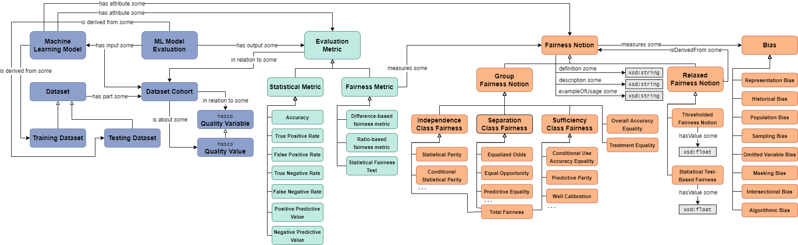

# Fairness Reporting

Auditing the fairness of AI models is a challenging process as defining what fairness means depends on the context of a specific application. Auditing an algorithm, regardless of its type, is a dynamic and non-linear process. Koshiyama et al. demonstrated the interrelation between development stages and auditing verticals in five main steps {cite}`koshiyama_towards_2021`:

**Stages:** | Data and Task Setup | Feature pre-processing | Model selection | Post-processing and Reporting| Productionizing and Deploying
----|---- | ---- | ----| ---- | ---- |
**Explainability**| Data collection and labelling | Dictionary of variables | Model complexity | Auxiliary tools | Interface and documentation
**Fairness** | Population balance | Fair representations | Fairness constraints | Bias metrics assessments | Real-time monitoring of bias metrics

In this process, keeping a recording of experiment findings and reporting them is a challenge for many development teams.

## Standardised Recording

We utilise Franklin et al.'s Fairness Ontology {cite}`franklin_ontology_2022` as the standard relational map of fairness notions and metrics. So, any fairness experiment report follows the organisational hierarchy of this ontology:



And for each fairness metric, each bias evaluation and mitigation result follows this schema in the reporting:

```yml
bias_metrics:
  facets:
    - name: ""
      metrics:
        - description: ""
          name: ""
          value: 0
      value_or_threshold: ""
      label: ""
      label_value_or_threshold: ""
```

This way, FAID can record the results in a fairness library agnostic way.

## ML Pipeline Fairness Monitoring Principles

Throughout bias evaluation and mitigation processes, we can list the following principles as broadly applicable rules across various machine learning scenarios:

### **1. Dataset Bias Identification and Evaluation**
   - **Data Source Examination**: Evaluate the origin of your data. Ensure diverse representation across different demographics or categories relevant to your use case.
   - **Class Imbalance Check**: Use statistical methods to check for class imbalances (e.g., compare counts across different groups). Ensure that minority groups are adequately represented.
   - **Correlation with Sensitive Attributes**: Test for correlations between features and sensitive attributes (e.g., gender, race). Identify if any input features are disproportionately correlated, which could lead to biased outcomes.
   - **Distribution Analysis**: Assess distributions of sensitive attributes in both training and test datasets. Ensure that the test set is not biased compared to the training set.

### **2. Preprocessing Techniques for Bias Mitigation**
   - **Data Augmentation**: If some groups are underrepresented, use augmentation techniques to artificially increase the representation of those groups.
   - **Re-Sampling**: Over-sampling for minority classes or under-sampling for majority classes can address imbalance, however such re-weighting algorithms might also result in reducing the overall accuracy.
   - **Fair Representation Sampling**: Implement techniques like stratified sampling to ensure a balanced representation of subgroups.
   - **Sensitive Attribute Removal**: Remove sensitive attributes if not required for the model, but be cautious of proxy variables that might still carry sensitive information.

### **3. Bias in Feature Engineering**
   - **Feature Relevance Analysis**: Analyze the importance of features in your model. Eliminate features whose impact on the outcome introduces unnecessary or discriminatory bias.
   - **Non-Sensitive Feature Derivation**: Ensure that any new derived features do not inadvertently reintroduce bias by correlating too closely with sensitive attributes.

### **4. Algorithmic Fairness Checks**
   - **Algorithm Selection**: Choose algorithms that are less prone to overfitting, as overfitting can exacerbate biases in the data.
   - **Model Explainability**: Use explainable models (or post-hoc explainability tools for black-box models) to identify how different features affect predictions for different groups.
   - **Hyperparameter Tuning**: Regularize models to reduce the potential for bias amplification during training.

### **5. Bias Evaluation Metrics**
   - **Group Fairness Metrics**:
     - **Demographic Parity**: Ensure that the prediction rates are similar across groups.
     - **Equalized Odds**: Evaluate whether your model has similar error rates (false positives and false negatives) for different groups.
   - **Individual Fairness**: Verify that similar individuals receive similar predictions, regardless of sensitive attributes.
   - **Calibration across Groups**: Ensure that predicted probabilities are well-calibrated across different demographic groups.

### **6. Post-processing Bias Mitigation**
   - **Outcome Adjustment**: After training, adjust decision thresholds for different groups to balance outcomes. For example, tune thresholds to equalize false positive or false negative rates.
   - **Reject Option Classification**: During model deployment, allow borderline cases to be classified with manual review to reduce the likelihood of biased outcomes.
   - **Fairness-Constrained Optimization**: Incorporate fairness constraints directly in the optimization process of your model to ensure that fairness objectives are met.

### **7. Deployment and Monitoring**
   - **Monitor for Drift**: Regularly monitor model inputs and outputs for data drift that might introduce bias over time.
   - **Feedback Loop**: Collect feedback from stakeholders (users or domain experts) to identify any perceived biases that were not anticipated during training.
   - **Continuous Re-Evaluation**: Re-evaluate the model periodically to assess if biases have emerged due to changing input data or real-world conditions.

### **8. Human-in-the-Loop Strategies**
   - **Manual Review of Outputs**: Implement a human-in-the-loop mechanism for reviewing predictions that have a higher likelihood of being influenced by bias.
   - **Bias Review Committee**: Establish a diverse team to periodically audit the model and its outputs for potential bias.

### **9. Ethical and Contextual Considerations**
   - **Stakeholder Involvement**: Engage affected communities or stakeholders during the model design and evaluation stages to understand which biases are most critical to mitigate.
   - **Impact Analysis**: Consider the social impact of false positives and false negatives for each group. Bias mitigation should prioritize minimizing harm to vulnerable groups.
   - **Transparency and Documentation**: Document all steps taken for bias mitigation and evaluation. Clearly communicate limitations and biases that may remain.


## Linking these Principles to Equality Act

The Equality Act (such as the UK's Equality Act 2010) aims to protect individuals from discrimination and promote equality across various protected characteristics, including age, disability, gender reassignment, race, religion or belief, sex, sexual orientation, marriage and civil partnership, and pregnancy and maternity. Here, we summarised how each bias evaluation and mitigation principle can align with Equality Act considerations to ensure compliance and ethical alignment:

### **1. Dataset Bias Identification and Evaluation**
   - **Data Source Examination**: Ensure datasets are inclusive of all protected characteristics to avoid direct or indirect discrimination. Data collection should represent protected groups to avoid underrepresentation, which could lead to unfavorable treatment of certain demographics.
   
   - **Class Imbalance Check**: Identify and mitigate any imbalances to prevent discrimination against underrepresented groups. Model training should ensure fairness by balancing groups, avoiding any bias in decision-making based on protected characteristics.
   
   - **Correlation with Sensitive Attributes**: Analyzing correlation helps prevent indirect discrimination through features that act as proxies for protected characteristics. Eliminate features that unfairly influence outcomes against any protected groups, thereby supporting equality in treatment.
   
   - **Distribution Analysis**: Verify balanced representation in both training and test datasets to prevent discrimination. Ensure fair consideration and treatment of all groups when building and validating models, maintaining compliance with anti-discrimination standards.

### **2. Preprocessing Techniques for Bias Mitigation**
   - **Data Augmentation**: Augmenting data for underrepresented groups addresses direct and indirect discrimination. This approach helps fulfill the Act’s requirement to ensure all groups have equal representation and opportunities.
   
   - **Re-Sampling**: Correcting class imbalance addresses potential negative impacts on marginalized groups. Re-sampling aligns with the Act by reducing the risk of biased outcomes that would otherwise disadvantage underrepresented classes.
   
   - **Fair Representation Sampling**: Stratified sampling helps prevent systemic bias and supports inclusive practices. Ensuring all groups are represented during training avoids inadvertently disadvantaging certain protected categories.
   
   - **Sensitive Attribute Removal**: Removing sensitive attributes can prevent direct discrimination. To comply with the Act, data should be processed in such a way that no undue bias related to protected characteristics is introduced.

### **3. Bias in Feature Engineering**
   - **Feature Relevance Analysis**: Removing biased features helps in preventing indirect discrimination. Analysis ensures that model decisions do not disproportionately affect groups defined by protected characteristics.
   
   - **Non-Sensitive Feature Derivation**: Ensures that new features do not reintroduce protected characteristic information in unintended ways. Derived features must be assessed to avoid indirect discrimination.

### **4. Algorithmic Fairness Checks**
   - **Algorithm Selection**: Choosing appropriate algorithms that minimize overfitting helps prevent biased outcomes. Algorithm choice should align with the Act’s requirements to ensure fair and equal treatment.
   
   - **Model Explainability**: Understanding how models make decisions helps ensure fairness across protected groups. Transparent model behavior supports accountability and compliance with anti-discrimination standards.
   
   - **Hyperparameter Tuning**: Regularizing models to avoid overfitting helps prevent amplification of biases. Model tuning must not create disproportionate disadvantages for any protected group.

### **5. Bias Evaluation Metrics**
   - **Group Fairness Metrics (Demographic Parity, Equalized Odds)**: Fairness metrics directly address the requirements for non-discrimination and equal treatment. Models should be evaluated using these metrics to ensure no group experiences unfair treatment or disadvantage.
   
   - **Individual Fairness**: Ensuring similar treatment for similar individuals prevents direct or indirect discrimination. This aligns with providing individuals within protected groups equal opportunities and rights.
   
   - **Calibration across Groups**: Calibration ensures that the likelihood of positive or negative outcomes does not disproportionately differ between groups. Models must treat all groups consistently, reflecting equal accuracy and fairness across protected categories.

### **6. Post-processing Bias Mitigation**
   - **Outcome Adjustment**: Adjusting thresholds helps balance outcomes, reducing the risk of adverse effects on vulnerable groups. Adjustments align with promoting equal outcomes as per the Equality Act’s provisions.
   
   - **Reject Option Classification**: Borderline cases being reviewed manually helps prevent potential discrimination in edge cases. This practice ensures that the final decisions do not unfairly disadvantage individuals from protected groups.
   
   - **Fairness-Constrained Optimization**: Fairness constraints in optimization prevent discriminatory model behavior. Models optimized under fairness constraints better align with legal obligations to treat protected groups equally.

### **7. Deployment and Monitoring**
   - **Monitor for Drift**: Data drift could reintroduce biases; monitoring helps mitigate this risk. Continuous monitoring is needed to ensure models continue to comply with anti-discrimination requirements.
   
   - **Feedback Loop**: Gathering feedback can reveal biases that negatively affect protected groups. A feedback loop helps maintain compliance by addressing new sources of discrimination as they arise.
   
   - **Continuous Re-Evaluation**: Periodic re-evaluation helps identify evolving biases. This ensures ongoing compliance with Equality Act mandates, particularly as societal dynamics evolve.

### **8. Human-in-the-Loop Strategies**
   - **Manual Review of Outputs**: A human review helps ensure that sensitive cases are not unjustly treated. Manual oversight is essential for ensuring fairness, especially when automated decisions might disproportionately impact certain groups.
   
   - **Bias Review Committee**: A diverse committee can help identify and mitigate unconscious biases. This aligns with requirements for fair treatment, as diverse perspectives help in reducing systemic bias.

### **9. Ethical and Contextual Considerations**
   - **Stakeholder Involvement**: Including affected communities helps understand biases from their perspective. Engagement with protected groups ensures that models are developed and evaluated in line with the principles of equality and non-discrimination.
   
   - **Impact Analysis**: Understanding the social impact ensures that decisions do not unjustly harm any protected group. Mitigating harm for vulnerable groups directly aligns with the Equality Act’s objective to protect against adverse impacts.
   
   - **Transparency and Documentation**:  Documenting mitigation strategies ensures accountability and transparency. Transparent reporting aligns with legal requirements, providing a basis to demonstrate adherence to equality and anti-discrimination standards.
