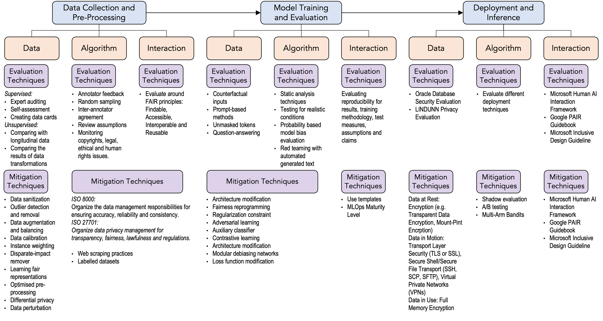

# A Structured Evaluation Approach

A safety evaluation generally requires a step-by-step analysis that considers each step of the development process individually and holistically. Creating a structured hierarchical evaluation (and mitigation) framework can help practitioners to accelerate the adoption of safe AI practices and consequently, define better risk management models. Here, we presented a sample structure, that we use in our current development processes: 

This structured framework brings existing concepts together to help researchers explore and understand a particular problem domain. In our case, we developed this conceptual framework to guide our risk taxonomy development. The framework consists of four levels: ML Steps, Components, Assessment and Implications.

-	**ML Steps:** A traditional ML pipeline includes data collection, data pre-processing, training, evaluation, inference and monitoring steps.
-	**Components:** For each development stage, we should consider data, algorithm and interaction components. For each component, we also use a standardised recording format. You can see an example for fairness reporting in Chapter [Fairness Reporting](../fairness/recording_standard.md).
-	**Assessment:** For each component of each step, we use the selected evaluation techniques, define potential harms, rank them based on their impacts, and consider mitigation techniques. It is a similar approach to risk analysis process of the cybersecurity domain:
    - **Evaluation:** Define security, privacy and fairness metrics and apply evaluation techniques based on the selected metrics. 
    - **Potential harm analysis:** We followed a categorical harm analysis approach, based on AHA! and CSET-AIID harm taxonomies:
        -	Quality of service harms
        -	Representational harms
        -	Legal and reputational harms
        -	Social, societal, and well-being harms
        -	Loss of rights or agency
        -	Allocational harms
    - **Mitigation:** Define tangible steps to increase security, privacy and fairness overall.
- **Implications:** The implications can be specific steps to be taken or generalized perspectives to consider in future iterations of the development process. Whether specific or generalized, they should lead to developing some tangible steps. We categorized implications under four headlines: “Security and privacy,” “environment and sustainability,” “usability and inclusivity,” and “infrastructure and maintenance.” 

## Example Illustration of LLM Evaluation and Mitigation Methods

The figure below illustrates curating possible evaluation and mitigation approaches for LLMs:

In data collection and processing:
- (Security) The security risks include data breaches and malicious injections. When a data breach occurs, it can potentially compromise sensitive information. Attackers might also inject poisoned data, causing biases or disrupting the model's performance. Even if we ensure security, privacy risks might harm users. For example, aggregated data might still carry the risk of re-identification, violating privacy if proper anonymization techniques are not employed. 
- (Privacy) Inadequate protection of personal or sensitive data might lead to unauthorized access. These are some intended harms. The data collection, by design, can also cause direct or indirect harm through bias. 
- (Fairness) Biases in the collected data might perpetuate unfairness in the subsequent models, affecting certain groups disproportionately.

The next step of an ML pipeline is model training and evaluation:
- (Security) Models might be vulnerable to adversarial attacks if not robustly trained, leading to misclassification. 
- (Privacy) Reversing the model might reveal sensitive training data. Adversaries might infer the presence of specific data in the training set. 
- (Fairness) Biases in the training data can perpetuate or amplify unfairness in model predictions.

The final step is deployment and inference:
- (Security) Improperly secured models can be stolen or copied, posing risks to intellectual property. Models can be tampered with during deployment, affecting the output or introducing vulnerabilities. 
- (Privacy) Inferences made on sensitive data during deployment might lead to inadvertent information leakage. Sharing inference results with third parties might inadvertently expose sensitive information. 
- (Fairness) Models might perpetuate biases, leading to unfair treatment or decisions for certain groups.
The ML security, privacy and fairness domains produce a vast amount of scholarly work on ML attacks and possible mitigations. Further, big tech companies, governments and NGOs publish various frameworks for secure, private and fair governance of AI. Managing these risks involves a combination of technological measures, rigorous compliance with data protection laws, ongoing monitoring, and continuous improvement in the understanding and implementation of ethical AI principles. 

## Limitations

This structured approach serves to initiate the evaluation process rather than providing an all-encompassing guarantee of fairness, privacy, or security. While structured, goal-oriented methodologies are valuable, they may overlook adversarial impacts that are less obvious or require innovative approaches. This tendency is reminiscent of the "invisible gorilla" phenomenon [^gorilla], a concept originating from cognitive science.

Similarly, in the context of AI evaluation, a structured approach may inadvertently lead evaluators to overlook certain aspects, such as subtle biases or unintended consequences, especially if they are not explicitly defined in the evaluation criteria. This underscores the importance of complementing structured methodologies with a critical awareness of potential blind spots, encouraging a more holistic assessment of AI systems.

In this sense, we promote our approach as a proactive framework to detect issues, however in a red-teaming activity we suggest using a mixed of methods including creative ways to trick systems.

[^gorilla]: In the "invisible gorilla" experiment (Chabris and Simons, 2010), participants were asked to watch a video of people passing basketballs and count the number of passes. Amidst this task, a person dressed in a gorilla suit would walk through the scene. Many participants failed to notice the gorilla due to their focused attention on counting passes. This experiment highlights the human tendency to overlook unexpected or irrelevant stimuli when our attention is narrowly focused on a specific task.

## Useful Resources

- A well-known recent effort is Stanford's HELM (Holistic Evaluation of Language Models): <https://crfm.stanford.edu/2022/11/17/helm.html>. The project, with a specific focus on transparency, measures seven metrics including *accuracy*, *calibration*, *robustness*, *fairness*, *bias*, *toxicity*, and *efficiency*.
- Toward Trustworthy AI Development: Mechanisms for Supporting Verifiable Claims. <https://arxiv.org/pdf/2004.07213#page=15.07>