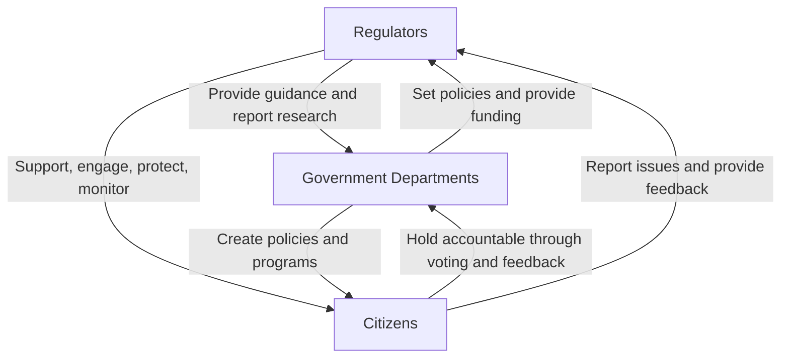

# Public Attitudes to AI

In early 2024, the U.S. equity markets reached multiple all-time highs, driven largely by investors' growing enthusiasm for artificial intelligence (AI) {cite}`j_p_morgan_private_bank_how_2024`. Microsoft’s New Future of Work Report 2023 demonstrated that the integration of LLMs is not only expected into internal applications, but many companies will also include them as client and worker-facing applications {cite}`butler_microsoft_2023`. It includes an array of tasks including LLMs for information work, critical thinking, human-AI collaboration, complex and creative tasks, domain-specific applications, team collaboration and communication, knowledge management and organisational change, future work and society.

The recent trend in investment on AI-powered services has shown that investors are increasingly building their strategies around the AI capabilities of businesses. In this competitive environment, companies are prioritising the rapid development of new AI functions with a primary focus on accuracy, often at the expense of inclusivity. Consequently, the public is likely to encounter more AI-powered tools that may lack inclusive and fair practices. Therefore, it is crucial to understand both perspectives: (1) public opinion on AI and (2) the efforts businesses are making to develop AI capabilities. This understanding can guide companies to create services that are more equitable, inclusive, and fair.

![The most important issues facing the country and opportunities for data use, August 2023 (Showing any issues for the UK selected by at least 5% of respondents; axes split along median value) [^1]](https://assets.publishing.service.gov.uk/media/656f2ea50f12ef07a53e0268/Slide2.SVG)

“Public Attitudes to AI” was also the name of CDEI’s (now it is called RTAU) 2024 report {cite}`cdei_24`. 95% of survey participants from the public claim that they heard of AI, with a significant portion (66%) stating they can provide at least a partial definition of it. Despite increasing familiarity and utilization of AI, persistent concerns are associated with the technology, with feelings of scary, worry, and unsure being frequently expressed.

## Building Trust for GenAI

The adoption of LLMs is quite prevalent, with around a third (34%) of the UK populace utilising chatbots in their personal lives on a monthly basis, and a quarter (24%) incorporating them into their work routines. Consequently, self-reported awareness and comprehension of AI among the UK public have shown an uptick since last year across various demographic segments, encompassing older individuals, those from lower socio-economic backgrounds, and individuals with lower levels of digital proficiency.

The report also revealed that health (21%), the cost of living (18%), and the economy (8%) appeared as the most promising data-driven opportunities in the public eye. The rest of the <10% opportunities are also digital economy related.

**Understanding public opinion on AI is crucial when developing AI-infused products and building "trust" around them. It can help us answer:**

- How can society benefit from the use of data or AI equally?
- How can we build the trust between organisations and citizens and ensure that organisations will be responsible for their actions?
- How can public change their perspective when the overall view on AI is pessimistic?
- How should we define the risk management strategies to help public to support the use of AI?
- How can we design AI-infused systems for the citizens with lower digital literacy?

These questions are in the intersection of anthropology, psychology, sociology and computer science. Human-computer interaction, and more specially, human-AI interaction researchers try to solve these challenges for years. Our current interaction with computing devices such as computers and mobile phones are based on this exhaustive research. Chapter [Evaluating and Mitigating Fairness in Financial Services: A Human-AI Interaction Perspective](../usecases/finance/interaction.md) shares a use case where we utilised Human-AI interaction guidelines and standards to evaluate some of existing financial service applications. The next chapter summarises AI evaluation techniques for a comprehensive auditing.

## Stakeholder Responsibilities from a Public Services Perspective

**Regulators** have a central role in establishing trust by setting standards and ensuring compliance with ethical and operational guidelines for AI. Through transparency artefacts—model and data cards as well as other recorded artefacts such as audit trails, bias analysis reports, and model performance metrics—regulators can review detailed logs and explanations and make an informed assessment on how AI systems make decisions, which is especially important in high-stakes areas like finance, healthcare, and criminal justice. Further, transparency artefacts offer evidence of whether AI systems are meeting regulatory standards for fairness, privacy, and security. This helps regulators hold organizations accountable and adjust guidelines to address new issues.

**Public sector** organizations using AI systems, such as LLMs, can leverage transparency artefacts to build trust with citizens and ensure the technology aligns with public values and interests. Using performance summaries, accuracy metrics, and explainability reports, public institutions can verify that AI systems are operating reliably and fairly in specific contexts, such as welfare programs or legal applications. Moreover, by making artefacts available to the public or relevant oversight bodies, public institutions can demystify AI decision-making processes, providing clarity on how conclusions or actions are reached.

**For citizens**, transparency artefacts can help them to understand AI decisions, however it also requires a certain level of digital literacy. Accessing simplified versions of transparency artefacts can help citizens to better understand how and why certain AI-driven decisions are made, such as eligibility for benefits or loan approvals. With access to transparency artefacts, citizens are empowered to ask questions and challenge decisions that seem unfair or opaque. This ensures that organizations deploying AI remain answerable to the public.

[^1]: Centre for Data Ethics and Innovation and Department for Science,
Innovation & Technology, 'Public attitudes to data and AI: Tracker
survey (Wave 3) (Section 6: Attitudes towards AI)'. Accessed: Mar. 18.
<https://www.gov.uk/government/publications/public-attitudes-to-data-and-ai-tracker-survey-wave-3/public-attitudes-to-data-and-ai-tracker-survey-wave-3>