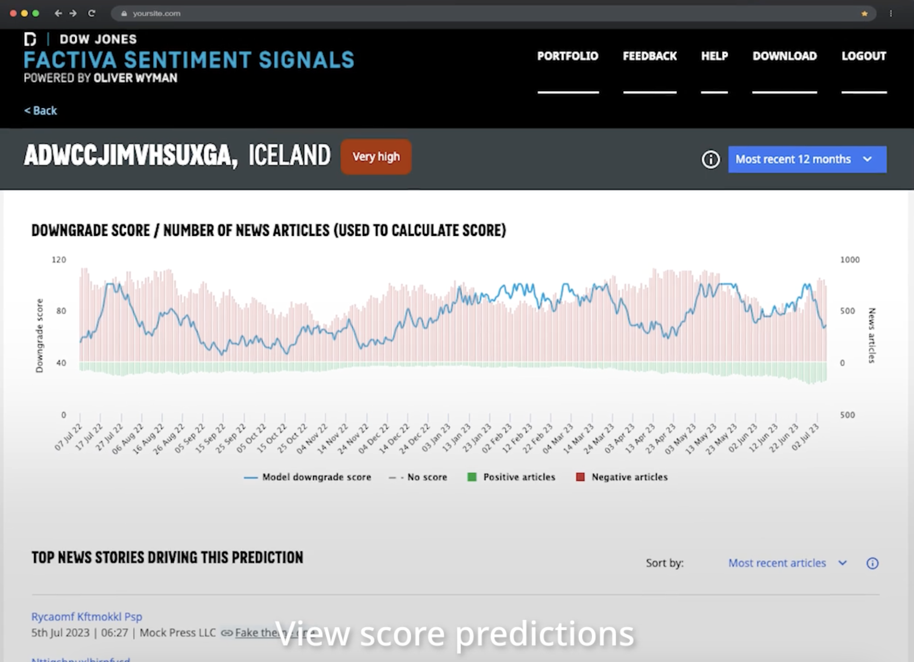
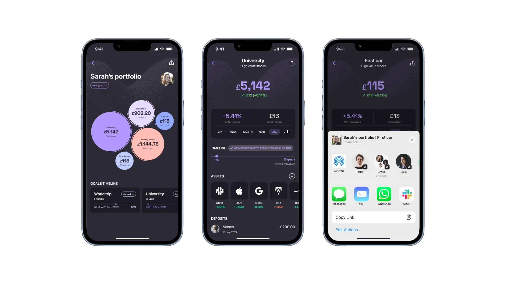
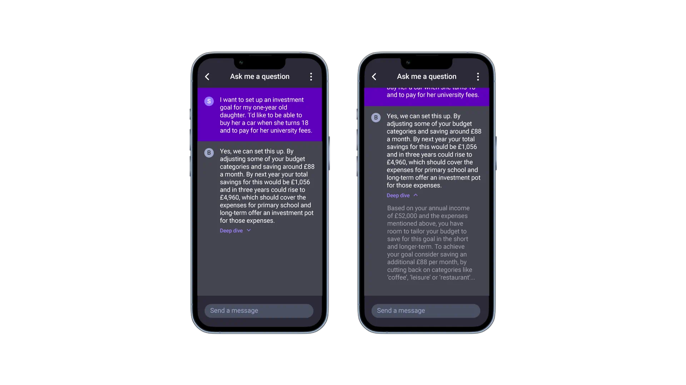

# Evaluating and Mitigating Fairness in Financial Services: A Human-AI Interaction Perspective

The finance sector is in a constant effort to provide robust and reliable products for customers. With the rapid progress in capabilities of large language models (LLMs), finance sector started transforming some of the critical services such as enhancing customer engagement, producing financial insights, and optimizing investment activities. However, the adoption of these advanced technologies brings fairness considerations as well as security, privacy and in general, trustworthiness. 

This article explores utilising the existing best practices and guidelines from Human-Computer Interaction (HCI) domain to evaluate and mitigate fairness in the system interaction level. We investigate two user interfaces and their interaction in the end-user level to discuss how HCI principles applied in these applications and what can be improved.

## The Role of LLMs in Financial Services

Aligned with our [previous report](https://www.turing.ac.uk/news/publications/impact-large-language-models-finance-towards-trustworthy-adoption), we focus on four financial service categories:

- **Public Communication and Customer Engagement:** LLMs can significantly improve customer service by providing timely and accurate responses to inquiries. Their human-like response generation capabilities can enhance user experience through personalized communication. Further, these models can handle a vast array of customer interactions and memorise old interactions and relational information to create complex personalised experiences.

- **Financial Service Safety:** The application of LLMs in detecting and preventing fraud is particularly promising. By analysing large datasets and identifying patterns, these models can help financial institutions develop safer products and conduct more thorough risk assessments.

- **Financial Insight Generation:** LLMs can generate valuable insights by processing market data, producing comprehensive reports, and offering personal investment advice. These insights can inform business finance decisions, optimise market surveillance, and aid in the generation of aggregate financial reports.

- **Financing and Investment Activities:** Investment banking, treasury optimization, private equity, venture capital, and asset allocation can benefit from improved data analysis and predictive modelling capabilities.

## Examples from Human-Financial Service Interaction 

While integrating “intelligent” mechanisms, each scenario requires a unique analysis of the interaction. In this article, we focus on two scenarios: Using LLMs in (1) asset management in the context of robo-advisors and (2) generating sentiment signals for market analysis. 

### Sentiment Signals for Market Analysis

 
*Figure is from [Dow Jones](https://www.dowjones.com/professional/factiva/)* 

The above figure illustrates a sentiment signal analysis interface introduced by Dow Jones. In this interface, we mainly see scores from two ML models: (1) A binary (positive-negative) document sentiment classifier, (2) Downgrade scorer based on sentiment signals. They also provide top documents that impacted the decision of the models most. These news documents support a level of human-in-the-loop approach and transparency.

The steps behind the scenes:

-  These systems gather data from multiple sources such as social media news articles, financial reports, blogs, forums, and other relevant platforms.
- Then, they pre-process the text (tokenization, stemming, and lemmatization) to break down the text into manageable pieces.
- After, sentiment signal classification algorithms can categorise text as positive, negative, or neutral. They can either (1) use predefined dictionaries of positive and negative words. (2) train models on labelled datasets to predict sentiment.
- Generally, most signal providers use an ensemble approach to aggregate the sentiment scores from different sources to generate an overall sentiment signal.
- We can validate the sentiment signals by backtesting against historical market data to ensure they provide reliable predictions.

After the model is ready, the system should present actionable insights based on the sentiment signals. This might involve setting thresholds to determine strong positive or negative sentiments that could indicate potential market movements. We shared one example interface that presents these sentiment signals to users.

### Robo-advisor for Personal Asset Management

Broadly, these applications use:
- Traditional rule-based algorithms for asset allocation, diversification, and rebalancing.
- Use machine learning for personalized recommendations, anomaly detection, and improving predictive accuracy.
- And, potentially, integrate sentiment analysis for market sentiment-driven investment strategies.
 

*Figures are from [Kin+Carta](https://www.kinandcarta.com/en/insights/2023/08/how-ai-holds-the-key-to-a-robo-advisory-reboot/)*

With the increasing availability of human-like language generation capabilities, these applications have been integrating chat interfaces as seen in the above figure. Chat interfaces provide a familiar space for novice users, which accelerates the adoption pace significantly as we witnessed in ChatGPT example. With the integration of a conversational AI can assist users in understanding their portfolio, making investment decisions, and resolving queries by asking questions in plain language. This conversational approach potentially make the interaction more intuitive and accessible, especially for novice investors.

However, integration of a chat interface also brings lots of ambiguity as the user can define queries in limited detail and system can generate an answer with assumptions. So, it brings risks of misunderstanding. 

To reduce the risks coming with conversational agent integration, designers can define the system affordances clearly and improve clarity of system capabilities can reduce this risk. Clearly communicating how data (both user and market) is collected, processed and interpretd can help users to intuitively understand the decisions behind the system.

## Improving Fairness through Human-AI Interaction

For both use cases, user personas can be categorized into three groups: professional investors, experienced investors, and novice investors. 

1. **Professional Investors**: Certified professionals with formal training and work experience in asset management. They typically manage multiple accounts.
2. **Experienced Investors**: Individuals with significant personal experience in managing their own assets, possessing a good understanding of risks and gains.
3. **Novice Investors**: Those with limited experience and a limited understanding of potential risks and their consequences.

As financial institutions integrate LLMs (we can generalise our concerns over all kind of black-box models), we should evaluate fairness from a human-AI interaction perspective and set the first line of defence through interaction. 

Fairness in this context means creating systems that are accessible, equitable, and free from bias. We can evaluate fairness across multiple layers:

- **Hardware and OS Layer:** For example, if a demographic group predominantly lacks access to a specific device type (e.g., Android vs iOS) and your model is only deployed on one type of device, it can prevent users from accessing your model.

- **Back-End Layer:** For example, the data sources and algorithms used in the model might inadvertently favour certain groups over others. If the data used to train the model is not representative of all user demographics, or if the model’s algorithms are not designed to account for such diversity, it can lead to biased outcomes that disadvantage underrepresented groups.

- **Front-End Layer:** For example, the colour scheme of your visualizations can affect accessibility for users with certain vision types. If the colour contrast is not sufficient, users with colour vision deficiencies may struggle to notice important changes in their portfolio.

By addressing these layers, we can ensure that the system is fair and accessible to all users.

### Evaluating Fairness: Key Considerations

Evaluating fairness in human-AI interaction, especially in the context of financial institutions integrating black-box models like LLMs, involves addressing a range of design decisions. Researchers should focus on both the technical and human-centric aspects to ensure that these models function fairly and equitably. Here are key questions that can guide this evaluation from an entity-based (data, model, system, user) perspective:

*Note that these questions aim to assess these entities in the interaction level. For example, for the model entity, we can mitigate "AI decision transparency" by selecting white-box interpretable model families. However, in this article, we focus on improving transparency of the model by interaction design choices.*

**Users**
- (Persona) Who will be using the AI system (e.g., customers, employees, stakeholders)?
- (Persona) What are the diverse demographics and characteristics of these users?
- (Skills) How are users informed about the AI system’s capabilities, limitations, and potential biases?
- (Skills) What educational resources are provided to help users understand and interact with the AI system effectively?

**Model**
- (Transparency) Can the decisions made by the AI model be explained in a clear and understandable way?
- (Transparency) What methods are in place to make the model’s decision-making process transparent to users?
- (Bias) What criteria are used to define fairness in this context (e.g., equal treatment, equitable outcomes)?
- (Bias) What metrics and tools are used to measure fairness and detect biases in the model?

**Data**
- (Inclusivity) Does the system demonstrates whether training data represent the diversity of the user base adequately?
- (Logging and monitoring) What strategies are employed to address and rectify any disparities found in the AI system’s decisions? How effective are these strategies in ensuring long-term fairness?

**System**
- (Harms) What are the potential negative impacts of unfair or biased decisions on users?
- (Perception) Do users perceive the AI system as fair and unbiased? How does user perception of fairness vary across different demographic groups?
- (Feedback) How can users provide feedback on the AI system’s performance and fairness?
- (Feedback) How is this feedback incorporated into the system’s ongoing development and improvement?
- (Regulation) How does the AI system comply with relevant regulations and standards on fairness and non-discrimination?

### Guiding the Design Process

HCI is a well-established research domain and we already have access to good standards and guidelines. By adopting some of the well-known principles from HCI, we can improve more fair and equitable interfaces while integrating smart features into our products. 

Implementing guidelines from ISO 9241 Ergonomics of Human-System Interaction and Microsoft Human-AI Interaction principles can help in designing fair and user-centric AI systems. These standards provide frameworks for usability, accessibility, and user satisfaction, ensuring that AI systems meet the needs of all users equitably.

### Conclusion

Fairness is not a one-time assessment but an ongoing process. Financial institutions should establish continuous monitoring systems to evaluate the performance of LLMs and ensure they remain fair over time. This includes regular audits, user feedback mechanisms, and updating models as new data becomes available.

Actively thinking about involving diverse stakeholders in the development and evaluation of AI systems can provide valuable perspectives on fairness. This includes collaborating with regulatory bodies, customer advocacy groups, and internal teams to ensure that the AI systems align with societal values and ethical standards.

Training AI practitioners and developers on ethical AI principles is vital. This involves educating them on the importance of fairness, the potential impact of biases, and the methods to mitigate them. An informed team is better equipped to develop fair AI systems.

Ensuring fairness in AI is a collective responsibility that requires ongoing effort, vigilance, and a commitment to ethical principles. Through these measures, the financial sector can achieve broader intelligence and serve its diverse customer base with integrity and fairness.
