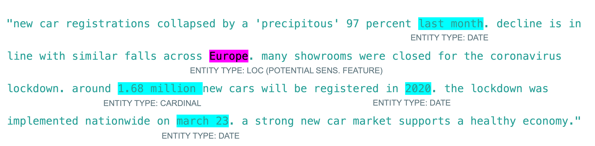
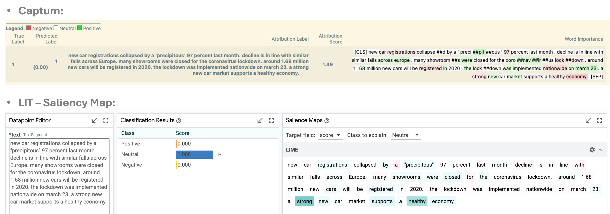

# Interpretability tools for improving fairness and equity

Explainable and interpretable AI fields have a long history of developing tools to better explain the models to improve robustness and reliability in the decision making process. We can also use the existing tools for improving fairness of the overall system. 

Deck et al. identifies seven archetypal claims about the relationship between explainable AI (XAI) and fairness {cite}`deck_critical_2024`:

1. XAI helps achieve (a generic notion of) fairness *(without specifying what kind of fairness is meant.)*
2. XAI enables humans to report on (formal) fairness *(often by analysing how sensitive features influence model decisions.)*
3. XAI enables humans to analyze sources of (formal) unfairness *(to identify the factors or data points that contribute to unfair outcomes.)*
4. XAI enables humans to mitigate (formal) unfairness *(to reduce unfairness through interventions like retraining models or adjusting features.)*
5. XAI informs human judgment of fairness *(aids stakeholders in assessing whether AI systems are fair based on the explanations provided.)*
6. XAI improves human perceptions of fairness *(to enhance users' trust and confidence in the fairness of AI systems.)*
7. XAI enables humans to implement subjective notions of fairness, *(allows stakeholders to incorporate their personal or context-specific fairness criteria into AI systems.)*

In this chapter, we demonstrate how we can use the existing tools for XAI for conducting experiments and make mitigation plans for fairness. First, let's give a brief overview of existing explanation and interpretation appraoches.

## Explanation Methods (Background)

Liao et al. categorises explainability methods under four categories {cite}`liao2020questioning`:

1. We can explain the global model behaviour by,
   - **Global feature importance**: Describes the weights of features used by the model.
   - **Decision tree approximation**: Approximates the model to an interpretable decision-tree.
   - **Rule extraction**: Approximates the model to a set of rules (e.g., if-then rules).
2. Or, we can create local explanations by using **local feature importance** and **saliency methods** and describe the rules that the instance fits to guarantee the prediction.
3. Another approach is innspecting counterfactuals:
    - **Feature influence or relevance method**: Shows how the prediction changes corresponding to changes in a feature.
    - **Contrastive or counterfactual features**: Describes features that will change the prediction if perturbed, absent, or present.
4. Finally, we can use example-based approaches:
   - **Prototypical or representative examples**: Provides examples similar to the instance with the same prediction.
   - **Counterfactual example**: Provides examples with small differences from the instance but with a different prediction.

```{note}
**Local Explanations to Interpret Global Behaviour**

- See the use of LIME: https://github.com/asabuncuoglu13/faid-test-financial-sentiment-analysis/notebooks/lime-finbert.ipynb
- See the use of Integrated Gradients: https://github.com/asabuncuoglu13/faid-test-financial-sentiment-analysis/notebooks/FinBERT-demo.ipynb
```

In this article, we focus on local explanations, saliency methods and example-based approaches. Then, we use Language Interpretability Tool (LIT) to interpret these outputs in one single interface.

## Language Interpretability Tool (LIT)

```{note}
See the use of LIT with custom FinBERT model: <https://github.com/asabuncuoglu13/faid-test-financial-sentiment-analysis/blob/main/notebooks/bias-eval/30-demo-lit-nlp.ipynb> (The notebook is inside the bias evaluation experiments in the main repository in case the code is refactored.) Run the code to see the LIT interface working with the given dataset. Or, you can check selected live demos in Google PAIR website: <https://pair-code.github.io/lit/demos/>
```

LIT is an open-source tool developed by Google Research to help practitioners understand and interpret the behavior of their language models. It provides a set of interactive visualisations and methods to explore and analyze models in a production setting. The tool offers: **(1) Interactive visualization**: of model outputs to grasp how different parts of a model contribute to its overall behavior. **(2) Support for multiple models**: allows users to compare the performance and behavior of different models side-by-side. **(3) Interpretability methods**, such as feature importance, saliency maps, and counterfactuals are integrated.

## Use Case: Interpretability Methods for Fairness Experiments in Financial Sentiment Analysis

A practitioner can use the [Language Interpretability Tool (LIT)](https://pair-code.github.io/lit/) to compare different sentiment analysis models (e.g., FinBERT, FinMA) and determine which model best captures financial sentiment from news articles, social media, or other sources.

One effective technique is the use of **saliency maps**, which highlight the words or phrases in a financial document that contribute most to the model's sentiment prediction. For instance, understanding why certain terms like *"profit warning"* or *"strong earnings"* lead to positive or negative sentiment predictions provides valuable insight into the model's decision-making process.

Another useful approach is **counterfactual testing**, where specific words or phrases are altered to observe how these changes affect sentiment predictions. This helps in understanding the model's sensitivity to different financial language elements.

**Identifying Bias in Financial Sentiment Analysis**: Phrase-level importance analysis is also valuable for identifying biases introduced by cultural or geographically specific terms. If certain words or phrases associated with specific regions have a direct impact on sentiment predictions, this could lead to **group disparities**. To systematically analyze these effects, we first need to create a **dictionary of country-specific phrases**. Named Entity Recognition (NER) can be used to extract entities that implicitly or explicitly reveal geographic or cultural information.

> The NER and Interpretability experiments are available here: https://github.com/asabuncuoglu13/faid-test-financial-sentiment-analysis/

**Real-World Dataset Example: Indian Financial News**: To illustrate this, let’s analyze a real-world dataset: [Indian Financial News Data (Hugging Face: kdave/Indian_Financial_News)](https://huggingface.co/datasets/kdave/Indian_Financial_News). This dataset includes an equal number of samples (n=8,987) for each sentiment category: *Positive*, *Negative*, and *Neutral*. Evaluating a sentiment model on this dataset allows us to assess its performance on financial terminology, currency mentions, and potential biases that arise when analyzing content from different geographic regions. A NER algorithm can highlight relevant entities and their types, as illustrated below:



**Augmenting Analysis with LLMs**: We can leverage **LLM-augmented review processes** to categorize and validate whether the identified entities originate from the Global South or Global North. This process involves:
1. Using an **LLM agent** to categorize and describe entities.
2. **Human annotation** to verify the correctness of classifications.

This ensures accuracy in detecting potential biases linked to geographic terminology.



**Challenges in Interpreting Saliency Maps**: Once saliency maps are generated, interpreting their findings remains challenging due to the lack of standardized methodologies. However, they serve as powerful tools for:
- Identifying influential words or phrases in model decisions.
- Uncovering potential biases through bottom-up analysis.

For example, in the figure above, the **Integrated Gradients method** indicated that the phrase *"across Europe"* contributed positively to the *Positive* sentiment classification in an Indian financial news sample, even though the actual label was *Negative*. Despite the true label being *Negative*, the model predicted *Positive* with **100% confidence**. To investigate, we can test the impact of the word *"Europe"* by replacing it with other regional terms (e.g., *Asia*, *Africa*). The prediction remained *Positive*, suggesting that *"Europe"* did not significantly influence the outcome according to LIME or IG. This indicates a **reliability issue** rather than a **fairness concern**.


**Future experiments and directions:**

1. Identify whether certain types of companies (e.g., large-cap vs. small-cap) or sectors are systematically receiving more positive or negative sentiment scores. This analysis is critical to uncovering unintended biases.
2. Use counterfactual analysis in LIT to test whether changing certain attributes (e.g., replacing the name of a well-known company with a lesser-known one) affects the sentiment score.
3. Examine model performance across different subgroups (e.g., technology vs. manufacturing sectors, we only used GS/GN definition).
4. Suggest training data, model architecture, or post-processing adjustments based on how model treats different types of financial entities.


## Limitations and Concluding Remarks

It is important to note that understanding AI's inner workings can be an essential mechanism for ensuring fairness, however even transparent algorithms can still produce unfair outcomes. XAI methods can detect bias by analysing feature importance, however current XAI tools often lack the necessary capabilities to reliably identify bias. These methods can also result in the risk of oversimplifying the underlying causes of unfairness. Further, developers might intentionally deceive vulnerable stakeholders, such as auditors or decision subjects, by creating misleading interfaces or explanations, for example, using adversarial attacks on explanation methods {cite}`chromik2019dark`.

Ehsan et al.'s sociotechnical XAI framework {cite}`ehsan_charting_2023` uses **trust**, **actionability**, and **values** as the three main components of social aspects in the explainability. **Trust component asks:** Where does trust breakdown in the AI system? Why? How might we re-calibrate trust (if needed)? How can we identify the AI’s blind spots and address them? **Actionability component asks:** What are barriers preventing informed actionability? What do users need to boost decision-making confidence? How can we empower users to confidently contest the AI? **And the values component asks:** How are values in tension & alignment amongst stakeholders? How is accountability distributed in the Human-AI tasks? What are organizational priorities around ethics? Together, the answers to these questions can bridge the gap between social and technical development of explainability component. 