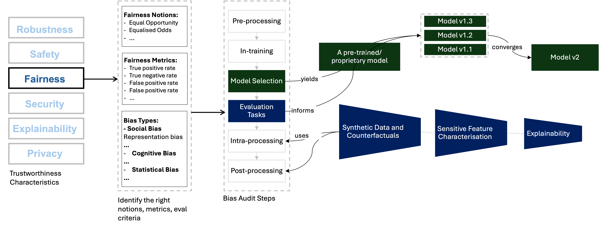

# Fairness of Large Language Models in Finance

Achieving fairness in AI-powered financial services requires addressing biases and disparities that may inadvertently affect certain demographic groups (protected characteristics). It is suggested to maintain a proactive (“by design” solutions) and iterative (continuous monitoring, evaluation, and development) process to effectively implement fairness strategies throughout the development.

We can define three major stages in a traditional AI development pipeline: (1) Data collection and pre-processing, (2) Algorithm development, training and testing, (3) Evaluation, red-teaming and deployment. Developing a fair AI pipeline begins with the collection of diverse and representative data, ensuring equitable representation across all customer segments. Transparent and explainable ML models play a crucial role, allowing users to understand the reasoning behind decisions and fostering trust in the system. Implementing fairness metrics and conducting regular audits enable proactive identification and mitigation of biases throughout the model's lifecycle. Human oversight remains essential, providing a safeguard against algorithmic biases and ensuring that decisions align with fairness principles.

By combining these bias mitigation strategies, financial institutions can cultivate AI systems that not only detect and prevent discrimination effectively but also uphold accuracy, security and privacy of the overall pipeline. So, in this sense, fairness applications should not be seen as a potential trade-off element that requires an extra effort (and money, and time), but should be organically integrated into the overall flow.

In this exploratory review, we will present an overall view of fairness in financial services and their practical implications in the LLM space. The main goal of this article is to help practitioners grasp fundamental concepts of fairness and implement some of the best practices in their application domain.

## LLMs in Financial Services

LLMs are the subject of significant interest from governments, regulators and many industry sectors, and are heavily featured in both the academic literature and the popular press. This shared interest underpins a thriving market valued at 10.5 billion USD in 2022 and is anticipated to reach 40.8 billion USD by 2029, demonstrating a compound annual growth rate of 21.4% between 2023 and 2029 {cite}`prnewswire_large_2023`.

The finance sector has always been one of the early adopters of cutting-edge technology.  Existing financial services are highly regulated and highly data-driven with machine learning (ML) playing a significant role in many services. A joint Bank of England (BoE) and FCA survey of financial services firms in the United Kingdom (UK) revealed that 72% of respondents use ML applications in their day-to-day applications {cite}`boe_machine_2022`.  The 2023 report of the Financial Policy Committee meeting states that, with the recent advances in LLMs, several financial firms have generated interest in the possibilities of integrating this technology into their services. Some financial companies and service providers to the financial sector have publicly expressed their experimentation with LLMs. However, the report reveals that the current exploration of use cases primarily involves low-risk activities, such as information search and retrieval or generating internal outputs, rather than automating business decisions .

A further 2023 survey from UK Finance, a trade association for the UK banking and financial services sector, revealed that more than 70% of participating financial institutions are in the proof of concept (PoC) stage for generative AI solutions, of which LLMs {cite}`boe_financial_2023`. One significant investment made by financial software and media company Bloomberg, BloombergGPT {cite}`wu_bloomberggpt_2023`,  has produced a 50 billion parameter model that can be utilised for an array of financial tasks such as news analysis and question answering. With such development, understanding the implications of large-language models in financial services advances the opportunity to set best practices for a critical economic sector, and provide examples that may be relevant to other industries.

:::{seealso}
- You can find more information about impact of LLMs in financial services in [the Alan Turing Institute's Impact of LLMs - March 2024 Report](https://www.turing.ac.uk/news/publications/impact-large-language-models-finance-towards-trustworthy-adoption).
- We also listed some background reading materials in [Background Reading List](./readinglist.md).
- Also check the chapter [A Practical Review of Financial Large Language Models](./finllms.md)
:::

## Bias in Finance LLMs

Bias encompasses a broad and complex spectrum of factors. The first challenge is generalisable to a wide variety of machine learning models. Within an algorithmic system, bias plays a necessary role in pattern recognition. However, throughout learning these patterns, the system can amplify bias while trying to increase the overall accuracy. Ideally, in LLM-powered systems, we aim for non-discrimination against specific groups while avoiding positive discrimination that could compromise model accuracy. Achieving this balance requires a delicate balance.

The second challenge is specific to financial models (but it is also shared with other domains). While various datasets exist for testing general-purpose LLMs against discrimination, the domain lacks datasets to assess LLMs tailored for financial services. Since there is no shared widely-used dataset to evaluate against discrimination, this assessment is constrained by the sociotechnical skills of financial organizations.

Further, bias in finance can also refer to various meanings. We listed some well-known bias types in financial-decision making. Despite all efforts shown to reduce bias in financial data and algorithm, an LLM still can suffer the following biases like a typical financial decision-maker. In the fair development process, we would like to prevent LLMs to demonstrating these behaviour or unconciously promoting this kind of behavior for a human decision-maker.

1. Confirmation bias: Favoring information that confirms existing beliefs.
2. Overconfidence bias: Overestimating one's own abilities or the accuracy of information.
3. Anchoring bias: Relying too heavily on the first piece of information encountered.
4. Loss aversion bias: Preferring to avoid losses over acquiring equivalent gains.
5. Availability bias: Judging the likelihood of an event based on how easily instances come to mind.
6. Herding bias: Following the actions of a crowd without considering personal judgment.
7. Endowment bias: Overvaluing what one already possesses compared to equivalent alternatives.
8. Framing bias: Making decisions based on how information is presented rather than its substance.

## Example Applications: Financial News Sentiment Analysis

Understanding public sentiment regarding company-specific developments as well as broader economic and political events is a common yet challenging task. In the finance sector, analysts combine a wide range of information sources to build comprehensive company profiles. NLP solutions, such as classification and clustering algorithms, are frequently used to assist with this analysis. Recently, LLMs have been increasingly utilized in this domain. Their advanced memory and context-understanding capabilities significantly enhance the ability to analyse and interpret vast amounts of text-based data, leading to more accurate and insightful assessments.

We can list three main challenges to define and measure fairness in news sentiment analysis:

1. News diversity is a multifaceted concept: Several sources (source diversity), topics (content diversity), and stances (viewpoint diversity) {cite}`alam_towards_2022`
2. The pre-trained LLM carries some bias for each source, topic and stance on a given topic.
3. Human monitoring is also open to bias depending on the socioeconomic and political view

A robust recipe is necessary to overcome these challenges and enable a proactive fairness evaluation. For example, in a news sentiment analysis application, we can define following steps beyond comparing some fairness metrics (Of course, also compare the metrics like FMR and FNMR):

- [Counterfactual inputs] Does the model behaviour change when we explicitly change sensitive attribute related phrases?
- [Comparative analysis of demographic parities between topic clusters] How do fairness metrics change in different topic clusters?
- [Interpret the results] And, we also need to answer what does it mean to reduce bias? Bias is an essential component of achieving pattern recognition. So, the model eventually has some bias based on the data. And when we develop a model, this model should also answer some business needs. Any financial services try to increase their profit. But it should also align with the greater good, considering environmental, social and governance (ESG) aspects. 

:::{note}
As illustrated in the figure above, we conducted a three-step representation bias evaluation for FinBERT's use in financial news analysis. [See the experiment notebooks.](https://github.com/asabuncuoglu13/faid-test-financial-sentiment-analysis/tree/main/notebooks/bias-eval) The first step of evaluation is to check the behaviour of the model against prompts related to countries from \textit{Global South} (GS) and \textit{Global North} (GN). We created a synthetic dataset to test the FinBERT's classification accuracy when the prompt explicitly reveals country information. Next, we monitored the performance on Indian financial news to check if the model performance is consistent when the data source includes different technical jargon, currency and other implicit bias sources.  Finally, we run interpretability methods such as LIME and saliency maps to see the word-level impact in individual level.
:::